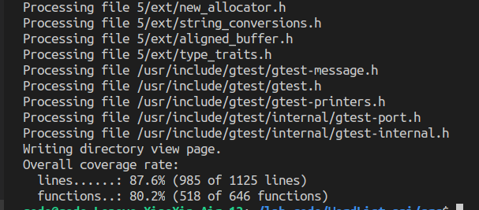
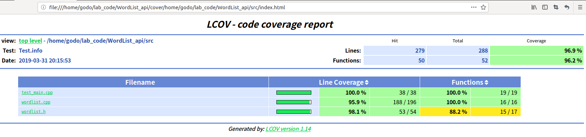

# 实验报告

[TOC]
## 接口实现原理
由于上次实验实现GUI时是曾将调用接口封装为动态库的形式，故此次实验也将接口封装为动态库，头文件中接口声明如下：
```C++
extern "C"
    {
    int get_chain_word(char* words,std::vector<std::string> &result,char head,char tail);
    int get_chain_char(char* words,std::vector<std::string> &result,char head,char tail);
    int get_chain_spec(char* words,int n,std::vector<std::vector<std::string>> &result,char head,char tail);
    }
```
三个接口函数都是接受未经处理的字符串，经过分割、处理后，找到指定需求的单词链，将其存入vector中，并返回单词链的长度或个数; 

其中，三个接口的第一个参数words均未为未经处理的字符串的地址，result存放单词链，它是一个存放string类型变量的vector，head和tail表示指定的首字母和尾字母，值为0时表示不指定首字母或尾字母;  

对于get_chain_spec函数，参数n为指定的单词链长度，其参数result是一个vector，这个vector的每个元素是一个存放string变量的vector，即result的每个元素是一个符合要求的单词链;  

get_chain_word的返回值为单词链长度，get_chain_char的返回值为单词链字母个数，get_chain_spec的返回值为符合要求的单词链的个数;

## 具体实现
* get_chain_word()和get_chain_char()和get_chain_spec()  

这三个函数的实现基本一致，故放在一起解释;其大体架构沿用了上次实验中GUI接口的编写思路：根据输入的参数设置各个flag，以实现不同的查找功能;  

这些参数中，inFileName 和 inputfromscreen是为图方便从GUI模块中直接沿用的参数，当inputfromscreen为true时，inFileName表示从屏幕输入的字符串，因此在这三个接口中，inputfromscreen始终为true;  

WordLens为true时表示要找最多单词的链，为false时表示要找最多字母的链，进行深度搜索时，若WordLens为true，则搜索深度为当前单词链长度，若为false则深度为目前单词链的字母个数;  
specWordLens指示是否指定了单词链长度，对应-n参数，若指定了长度，则在DFS中不会搜索比这更深的单词链;  
spechead和spectail指示是否指定了首尾字母，若指定了保存在head和tail中;

Init函数会将需要用到的全局变量全部初始化，如最长单词链长度清零，存放结果的容器清空，以免因变量未释放而出现错误;  

loadingWords函数进行预处理：将未处理字符串分割成单词，并根据其首尾字母将单词存入矩阵中，以待后续使用;  

Find_WordList函数根据不同参数的设定调用DFS，找到要求的单词链;

output函数将结果存入相应的全局变量中;

最后接口函数将对应全局变量的结果复制给result，以待调用者使用;  

get_chain_char函数的区别仅在于WordLens置为false;而get_chain_spec函数的区别在于将specWordLens置为真，并将指定长度赋给了相应的全局变量，且最后调用的输出函数不同;
```C++
int wordList::get_chain_word(char* words,vector<string> &result,char head,char tail)
{
    inFileName = words;
    WordLens = true;//find wordlist with max words 
    specWordLens = false;//whether specify the length 
                        //of wordlists
    inputfromscreen = true;
    if(head!='\0'){
        spechead = true;//whether specify the head
                        //letter
        wordList::head = head;
    }
    else spechead = false;
    if(tail!='\0'){
        spectail = true;
        wordList::tail = tail;
    }
    else spectail = false;

    Init(); //init all the golbal variables
    wordList::loadingWords();//divide the input string 
                            //into words and preprocess
    wordList::Find_WordList();//DFS
    wordList::output();

    for(auto it = maxWordList_api.begin();it != maxWordList_api.end();it++)
        result.push_back(*it);
    return maxLength;
}
```
## 封装成动态连接库
要将接口函数封装成动态连接库，本次实验采用的方法为将源文件worlist.cpp编译为动态连接库文件libwordlist.so,并将其所在目录加入共享库，在编译测试程序时，包含相应目录，调用相应的库文件;实验中采用make指令编译，Makefile文件如下：
```C++
CC=g++ -std=c++11 -shared -fPIC
GCC = g++ -std=c++11


main:test_main.o libwordlist.so
	$(GCC) -fprofile-arcs -ftest-coverage -o $@ $< -I./ -L./ -lwordlist -lgtest -lpthread
wordlist.o:wordlist.cpp wordlist.h
	$(GCC) -c $< -o $@ -fprofile-arcs -ftest-coverage
libwordlist.so:wordlist.o
	$(CC) -o $@ wordlist.cpp -fprofile-arcs -ftest-coverage
test_main.o:test_main.cpp
	$(GCC) -c $^ -o $@ -fprofile-arcs -ftest-coverage

clean:
	rm -f *.o

```
其中test_main即为单元测试文件，为使程序成功运行，需要每次启动命令行时，在src目录下，用"export LD_LIBRARY_PATH=./"命令将当前目录加入共享库;

## 单元测试
* 测试环境  
单元测试采用了gtest工具，实验时为了使用此工具，采用了以下指令安装，并在其目录下进行编译，将生成libgtest.a 和 libgtest_main.a文件拷d到了系统的lib目录下：  
```C++
sudo apt-get install libgtest-dev
cd /usr/src/gtest
sudo mkdir build 
cd build
sudo cmake ..  
sudo make   
sudo cp libgtest*.a /usr/local/lib
```
* 单元测试代码  
为使用gtest工具，编译单元测试程序时，加入了-lgtest -lpthread参数，见Makefile文件：  
代码如下，其中单词链正确长度等数据取自运行相同数据的上次实验的结果： 
* TEST1测试了寻找最长单词链的功能，判断了其单词链长度是否正确以及单词链是否首尾相连;
* TEST2测试了寻找最多字母单词链的功能，判断了其单词链长度是否正确以及单词链是否首尾相连;
* TEST3测试了指定首尾字母的功能是否正确，除以上检查外，还检查了首尾字母是否为指定字母;
* TEST4测试了指定单词链长度的功能是否正确，检查了返回的单词链个数以及每个单词链的长度是否正确。

```C++
#include<gtest/gtest.h>
#include<string>
#include<vector>
#include"wordlist.h"
using namespace std;

char s[] = "asdf fsetsgsdgdshf fsersds Fsrtf sdfsg dfhd dfv veTry ye eth hup pose";
int lens;
vector<string> result1;
vector<vector<string>> result2;
string a,b;

TEST(Test1,FindMaxWordsChain)
{
    lens = wordList::get_chain_word(s,result1,0,0);
    ASSERT_EQ(lens,7);
    for(int i = 0;i < result1.size()-1;i++){
        a = result1.at(i);
        b = result1.at(i+1);
        ASSERT_EQ(a[a.size()-1],b[0]);
    }
    result1.clear();
}

TEST(Test2,FindMaxCharsChain)
{
    lens = wordList::get_chain_char(s,result1,0,0);
    ASSERT_EQ(lens,34);
    for(int i = 0;i < result1.size()-1;i++){
        a = result1.at(i);
        b = result1.at(i+1);
        ASSERT_EQ(a[a.size()-1],b[0]);
    }
    result1.clear();
}

TEST(Test3,FindSpecHTChain)
{
    lens = wordList::get_chain_word(s,result1,'d','p');
    ASSERT_EQ(lens,6);
    for(int i = 0;i < result1.size()-1;i++){
        a = result1.at(i);
        b = result1.at(i+1);
        ASSERT_EQ(a[a.size()-1],b[0]);
        if(i==0) ASSERT_EQ(a[0],'d');
        if(i==result1.size()-2) ASSERT_EQ(b[b.size()-1],'p');
    }
    result1.clear();
}

TEST(Test4,FindSpecLengthChain)
{
    lens = wordList::get_chain_spec(s,3,result2,0,0);
    ASSERT_EQ(lens,16);
    for(auto it = result2.begin();it != result2.end();it++)
        ASSERT_EQ(it->size(),3);
}

int main(int argc,char*argv[])
{
    testing::InitGoogleTest(&argc,argv);
    return RUN_ALL_TESTS();
}
```
* 测试截图


## 覆盖率测试
覆盖率测试使用lcov工具实现，使用此工具，在编译单元测试文件时加上-fprofile-arcs -ftest-coverage参数，运行单元测试程序后，采用以下指令，将结果输入到cover文件夹：  
* 注：要进行完整的测试，直接运行src目录下的./run.sh脚本即可
```C++
lcov -d . -t 'Test' -o 'Test.info' -b . -c
genhtml -o ../cover/ Test.info
```
* 覆盖率截图


可见，命令行中直接给出的总覆盖率，因为包含了gtest的源码，因此覆盖率不高，而实验中编写的文件test_main.cpp,wordlist.h与wordlist.cpp的总覆盖率均在90%以上，符合条件。
