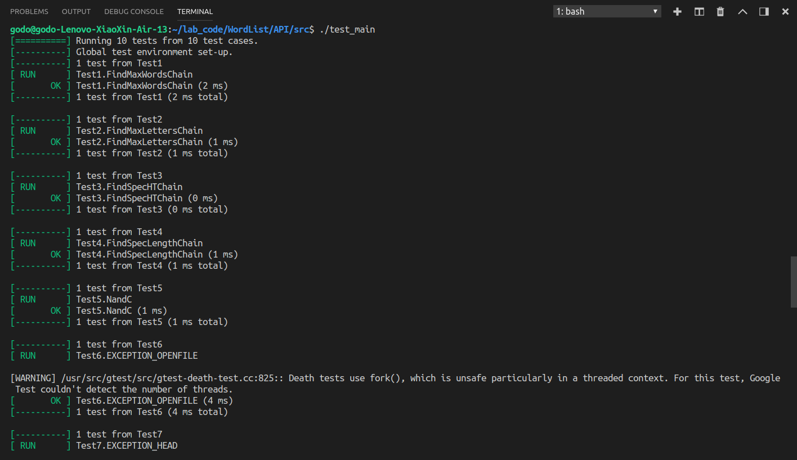

# 实验报告

[TOC]

## 实验环境
* 操作系统：Ubuntu   
* 编程语言：C++  
* 单元测试所用工具：gtest  
`注`：实验中使用gtest时，将libgtest.a 和 libgtest_main.a文件拷d到了系统的lib目录下，为了程序能在其他主机上编译成功，将安装即配置所用的命令附上：
```
sudo apt-get install libgtest-dev
cd /usr/src/gtest
sudo mkdir build 
cd build
sudo cmake ..  
sudo make   
sudo cp libgtest*.a /usr/local/lib
```
* 接口封装方式：封装为静态库，即.so文件，为了使编译时能链接到生成的库文件，请每次启动命令行后，先在src目录下执行以下命令：
```
export LD_LIBRARY_PATH=./
```
## 新增

### 新增接口

`void text_preprocess(char* filename, string &rawstr);`
* 接口的主要目的是打开对应文件，获取其中字符串，将读出的字符串直接返回
* 其中处理关于文件未打开的异常
* 至于字符串分割单词的处理，我们放到了另外原来的三个接口当中，处理的函数为LoadingWords

### 命令行处理

`void cmdParametersParser(int argc, char **argv)`

接受命令行的main函数传入命令行解析函数，然后通过getopt并使用case语句修改全局变量，设定参数,再根据输入的参数调用相应接口  
其中命令行选项的值通过getopt_core.h中定义的*optarg获得

### 异常处理

关于命令行参数的异常：
* w,c,n必须存在一个
* 文件的缺失放在了text_process接口中
* w,n互斥，不能同时存在
* w,c不能同时出现，每种参数只能出现一次  

关于接口中异常的处理：
* 文件不存在或未输入文件名，此异常在text_process中处理
* 指定的首尾字母不是英文字母
* 传入的字符串中不含单词
* 指定的单词链长度构不成链，即n<2的情况  
处理接口中异常的主要函数为如下：
```C++
void wordList::HandleException()
{
    try{
        if(spechead && !isalpha(head)){
            throw "The value of argument -h must be a letter";
        }
        if(spectail && !isalpha(tail)){
            throw "The value of argument -t must be a letter";
        }
        if(wordnum == 0){
            throw "There is no words in input file";
        }
        if(specWordLens && specLength < 2){
            throw "The specified word length must >1";
        }

    }
    catch(const char* msg){
        cerr << msg << endl;
        exit(1);
    }
}

```

## 接口实现原理
由于上次实验实现GUI时是曾将调用接口封装为动态库的形式，故此次实验也将接口封装为动态库，头文件中接口声明如下：
```C++
extern "C"
    {
    void text_preprocess(char* filename, string &rawstr);
    int get_chain_word(string &words,std::vector<std::string> &result,char head,char tail);
    int get_chain_char(string &words,std::vector<std::string> &result,char head,char tail,bool specn=false,int n=0);
    int get_chain_spec(string &words,int n,std::vector<std::vector<std::string>> &result,char head,char tail);
    }
```
新增接口在上面已叙述过，其他三个接口函数，都是接受未经处理的字符串，经过分割、处理后，找到指定需求的单词链，将其存入vector中，并返回单词链的长度或个数; 

其中，三个接口的第一个参数words均为为未经处理的字符串，类型为string，result存放单词链，它是一个存放string类型变量的vector，head和tail表示指定的首字母和尾字母，值为0时表示不指定首字母或尾字母;  

对于get_chain_spec函数，参数n为指定的单词链长度，其参数result是一个vector，这个vector的每个元素是一个存放string变量的vector，即result的每个元素是一个符合要求的单词链;  

`注意，为了实现-w与-c参数同时选择，为get_chain_char函数增加了两个默认参数specn和n; specn指示是否指定单词链长度，n为指定的单词链长度,默认specn=false,n=0，当同时选择-w和-c时，可选择这两个参数传入，实现寻找指定长度的字母最多的单词链的功能，此处接口参数定义与给定的有所出入`

get_chain_word的返回值为单词链长度，get_chain_char的返回值为单词链字母个数，get_chain_spec的返回值为符合要求的单词链的个数，`为避免返回的单词链过多，接口中为单词链数量设置了上限：当找到的符合要求的单词链超过10000个时，只返回前10000个`;

## 具体实现
* get_chain_word()和get_chain_char()和get_chain_spec()  

这三个函数的实现基本一致，故放在一起解释;其大体架构沿用了上次实验中GUI接口的编写思路：根据输入的参数设置各个flag，以实现不同的查找功能;  

这些参数中，inFileName 和 inputfromscreen是为图方便从GUI模块中直接沿用的参数，当inputfromscreen为true时，inFileName表示从屏幕输入的字符串，因此在这三个接口中，inputfromscreen始终为true;  

WordLens为true时表示要找最多单词的链，为false时表示要找最多字母的链，进行深度搜索时，若WordLens为true，则搜索深度为当前单词链长度，若为false则深度为目前单词链的字母个数;  
specWordLens指示是否指定了单词链长度，对应-n参数，若指定了长度，则在DFS中不会搜索比这更深的单词链;  
spechead和spectail指示是否指定了首尾字母，若指定了保存在head和tail中;

Init函数会将需要用到的全局变量全部初始化，如最长单词链长度清零，存放结果的容器清空，以免因变量未释放而出现错误;  

loadingWords函数进行预处理：将未处理字符串分割成单词，并根据其首尾字母将单词存入矩阵中，以待后续使用;  

Find_WordList函数根据不同参数的设定调用DFS，找到要求的单词链;

output函数将结果存入相应的全局变量中;

最后接口函数将对应全局变量的结果复制给result，以待调用者使用;  

get_chain_char函数的区别仅在于WordLens置为false;而get_chain_spec函数的区别在于将specWordLens置为真，并将指定长度赋给了相应的全局变量，且最后调用的输出函数不同;
```C++
int wordList::get_chain_word(string &words,vector<string> &result,char head,char tail)
{
    inFileName = words;
    WordLens = true;
    specWordLens = false;
    inputfromscreen = true;
    if(head!='\0'){
        spechead = true;
        wordList::head = head;
    }
    else spechead = false;
    if(tail!='\0'){
        spectail = true;
        wordList::tail = tail;
    }
    else spectail = false;

    Init();
    wordList::loadingWords();
    HandleException();
    wordList::Find_WordList();
    wordList::output();

    for(auto it = maxWordList_api.begin();it != maxWordList_api.end();it++)
        result.push_back(*it);

    if(result.size()< 2){//if the result contains only one word,it's not acceptable
        result.clear();
        maxLength = 0;
    }
    return maxLength;
}

```
## 封装成动态连接库
要将接口函数封装成动态连接库，本次实验采用的方法为将源文件worlist.cpp编译为动态连接库文件libwordlist.so,并将其所在目录加入共享库，在编译测试程序时，包含相应目录，调用相应的库文件;实验中采用make指令编译，Makefile文件如下：
```C++
CC=g++ -std=c++11 -shared -fPIC
GCC = g++ -std=c++11


test_main:test_main.o libwordlist.so main
	$(GCC) -o $@ $< -I./ -L./ -lwordlist -lgtest -lpthread
main:main.o
	$(GCC) -o $@ $< -I./ -L./ -lwordlist
main.o:cmd.cpp
	$(GCC) -c $^ -o $@
wordlist.o:wordlist.cpp wordlist.h
	$(GCC) -c $< -o $@ 
libwordlist.so:wordlist.o
	$(CC) -o $@ wordlist.cpp 
test_main.o:test_main.cpp
	$(GCC) -c $^ -o $@ 
.PHONY: clean
clean:
	-rm -f *.o
```
其中test_main即为单元测试程序，main为最终实现的命令行主程序，`为使程序成功运行，需要每次启动命令行时，在src目录下，用"export LD_LIBRARY_PATH=./"`命令将当前目录加入共享库;

## 单元测试
单元测试主要测试接口的功能是否实现以及接口中的异常能否处理，命令行输入的异常测试见main函数测试部分。
* 测试环境  
`单元测试采用了gtest工具，实验时为了使用此工具，采用了以下指令安装，并在其目录下进行编译，将生成libgtest.a 和 libgtest_main.a文件拷d到了系统的lib目录下： ` 
```C++
sudo apt-get install libgtest-dev
cd /usr/src/gtest
sudo mkdir build 
cd build
sudo cmake ..  
sudo make   
sudo cp libgtest*.a /usr/local/lib
```
* 单元测试代码  
为使用gtest工具，编译单元测试程序时，加入了-lgtest -lpthread参数，见Makefile文件：  
代码如下，其中单词链正确长度等数据取自运行相同数据的上次实验的结果： 
* TEST1测试了寻找最长单词链的功能，判断了其单词链长度是否正确以及单词链是否首尾相连;
* TEST2测试了寻找最多字母单词链的功能，判断了其单词链长度是否正确以及单词链是否首尾相连;
* TEST3测试了指定首尾字母的功能是否正确，除以上检查外，还检查了首尾字母是否为指定字母;
* TEST4测试了指定单词链长度的功能是否正确，检查了返回的单词链个数以及每个单词链的长度是否正确。
* TEST5测试-w与-c同时使用，即寻找字母最多的指定长度的单词链是否正确;
* TEST6-10为异常测试，分别测试了出现以下情况时能否抛出异常：文件不存在或未指定打开文件、指定的首或尾字母不是字母、打开的文件中不含单词、指定单词链长度时n小于2。

```C++
#include<gtest/gtest.h>
#include<string>
#include<vector>
#include"wordlist.h"
using namespace std;

string s = "asdf fsetsgsdgdshf fsersds Fsrtf sdfsg dfhd dfv veTry ye eth hup pose";
string ss = "  ";
char filename[] = " ";
int lens;
vector<string> result1;
vector<vector<string>> result2;
string a,b;
//test get_chain_word
TEST(Test1,FindMaxWordsChain)
{
    lens = wordList::get_chain_word(s,result1,0,0);
    ASSERT_EQ(lens,7);
    for(int i = 0;i < result1.size()-1;i++){
        a = result1.at(i);
        b = result1.at(i+1);
        ASSERT_EQ(a[a.size()-1],b[0]);
    }
    result1.clear();
}
//test get_chain_char
TEST(Test2,FindMaxLettersChain)
{
    lens = wordList::get_chain_char(s,result1,0,0);
    ASSERT_EQ(lens,34);
    for(int i = 0;i < result1.size()-1;i++){
        a = result1.at(i);
        b = result1.at(i+1);
        ASSERT_EQ(a[a.size()-1],b[0]);
    }
    result1.clear();
}
//test the head letter and tail letter
TEST(Test3,FindSpecHTChain)
{
    lens = wordList::get_chain_word(s,result1,'d','p');
    ASSERT_EQ(lens,6);
    for(int i = 0;i < result1.size()-1;i++){
        a = result1.at(i);
        b = result1.at(i+1);
        ASSERT_EQ(a[a.size()-1],b[0]);
        if(i==0) ASSERT_EQ(a[0],'d');
        if(i==result1.size()-2) ASSERT_EQ(b[b.size()-1],'p');
    }
    result1.clear();
}
//test get_chain_spec
TEST(Test4,FindSpecLengthChain)
{
    lens = wordList::get_chain_spec(s,3,result2,0,0);
    ASSERT_EQ(lens,16);
    for(auto it = result2.begin();it != result2.end();it++)
        ASSERT_EQ(it->size(),3);
}

//test find the most letters chain with length of n
TEST(Test5,NandC)
{
    lens = wordList::get_chain_char(s,result1,0,0,true,3);
    ASSERT_EQ(lens,25);
    ASSERT_EQ(result1.size(),3);
}
//test exception:file doesn't exist
TEST(Test6,EXCEPTION_OPENFILE)
{
    EXPECT_DEATH(wordList::text_preprocess(filename,s),"File does not exist or no file choosed");
}

//test exception:The head is not a letter
TEST(Test7,EXCEPTION_HEAD)
{
    EXPECT_DEATH(wordList::get_chain_word(s,result1,1,0),"The value of argument -h must be a letter");
}

//test exception:The tail is not a letter
TEST(Test8,EXCEPTION_TAIL)
{
    EXPECT_DEATH(wordList::get_chain_word(s,result1,0,1),"The value of argument -t must be a letter");
}

//test exception:thers is no word in the file
//ss is an empty string
TEST(Test9,EXCEPTION_EMPTY)
{
    EXPECT_DEATH(wordList::get_chain_word(ss,result1,0,0),"There is no words in input file");
}

//test exception:n is too small
TEST(Test10,EXCEPTION_N)
{
    EXPECT_DEATH(wordList::get_chain_spec(s,-1,result2,0,0),"The specified word length must >1");
}

int main(int argc,char*argv[])
{
    testing::InitGoogleTest(&argc,argv);
    return RUN_ALL_TESTS();
}
```
* 测试截图


## main函数测试用例
1. -w -f（基本测试）
2. -c -f
3. -n -f (big scale， 大数据测试)
4. -h -t -f (exception， 不存在wcn参数)
5. -w -h -t -f（三种组合）
6. -c -h -t -f
7. -n -h -t -f
8. -n -c -h -t -f（最复杂组合测试）
9. -n -w -f(exception， 不和谐参数异常)
10. -w -c -f(exception， 冲突参数)