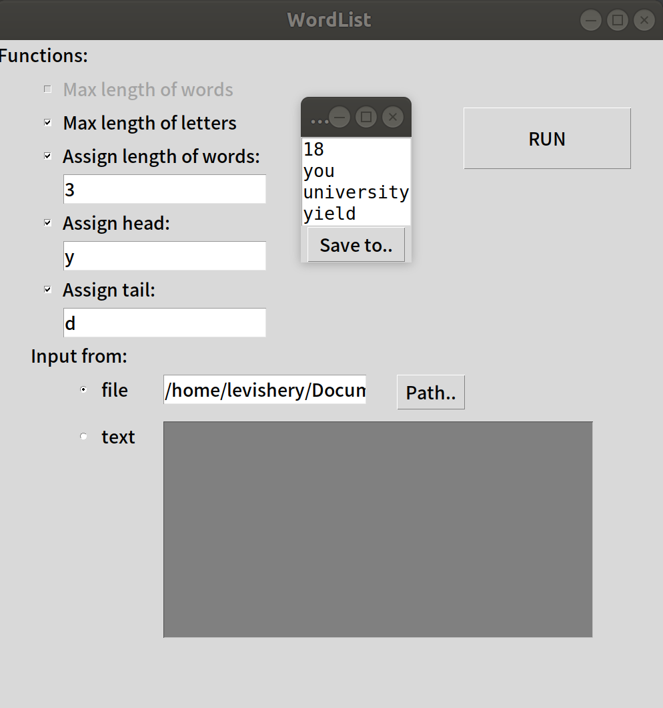

# Document

[TOC]

## 实现原理
### 单词过滤：
过滤异常，非字母单词，对于由特殊符号相连的单词进行分词，并调整字母为小写。
```C++
void wordList::loadingWords(){
    std::unordered_map<std::string, int> Smap;
    std::ifstream inFile(inFileName+FileName);
    while(!inFile.eof())
    {
        std::string S;
        inFile>>S;
        auto Svector = filter(S);
        for(auto it = Svector.begin(); it != Svector.end(); it++){
            auto s = *it;
            if(Smap.count(s) == 0){
                Smap[s] = 1;
                COUT(s);
                wordMatrix.incCount(s);
                wordMatrix.pushWord(s);
            }          
        }
    }
    outputMatrix();
    inFile.close();
}
```
### 单词同一化：
将所有单词进行分类，所有首尾相同的单词为同一类，并将其嵌入到一个wordMatrix中。


### 命令行解析：
通过对命令行参数的判断，将得到不同的程序实现条件，这些Flag将会在之后的程序分支中使用。 

新增了参数-f，用来单独指示打开的文件
```C++
void cmdParametersParser(int argc, char **argv){
    int ch;

    while((ch=getopt(argc,argv,"wch:t:n:f:"))!=-1)
    {
        switch(ch)
        {
            case 'w':
                    wordList::WordLens = true;
                    wordList::wc_paranum ++;
                    break;
            case 'c':
                    wordList::WordLens = false;
                    wordList::wc_paranum ++;
                    break;
            case 'h':wordList::temp_head = optarg;
                    wordList::spechead = true;
                    wordList::h_paranum ++;
                    COUT(wordList::head);break;
            case 't':wordList::temp_tail = optarg;
                    wordList::spectail = true;
                    wordList::t_paranum ++;
                    COUT(wordList::tail);break;
            case 'n':wordList::specWordLens = true;
                    wordList::specLength = StringtoNum(optarg);
                    wordList::n_paranum ++;
                    COUT(wordList::specLength);
                    break;
            case 'f':wordList::FileName = optarg;
                    wordList::inputfromscreen = false;
                    wordList::f_paranum ++;
                    COUT(wordList::FileName);
                    break;
            default:;
        }

    }

}
```
### 命令异常处理：
处理的异常命令包括：-w、-c、-n均未选择、未选择打开文件、-w与-c冲突、-w与-n冲突、参数重复输入、选择参数-n时指定长度<2、-h、-t、-n参数类型错误。
打开文件不存在、未找到符合要求的单词链等异常在程序其他部分处理。
```C++
void HandleException()
{
    if(wordList::wc_paranum == 0 && !wordList::specWordLens){
        std::cout << "-w or -c or -n must be chooesd " <<std::endl;
        exit(0);
    }

    if(wordList::wc_paranum > 1||wordList::h_paranum > 1||wordList::t_paranum > 1
        ||wordList::n_paranum > 1||wordList::f_paranum > 1){
        std::cout << "The same parameter can occur only once" <<std::endl;
        exit(0);
    }

    if(wordList::inputfromscreen){
        std::cout <<"No file opened" <<std::endl;
        exit(0);
    }
    if(wordList::wc_paranum == 1 && wordList::WordLens && wordList::specWordLens){
        std::cout << "-w and -n cannot be choosed together" <<std::endl;
        exit(0);
    }
    if(wordList::specWordLens && wordList::specLength <2){
        std::cout << "Word length should >1" <<std::endl;
        exit(0);
    }
    if(wordList::spechead && (wordList::temp_head.size()!=1 || !isalpha(wordList::temp_head[0]))){
        std::cout << "The value of -h should be a character"<<std::endl;
        exit(0);
    }
    else if(wordList::spechead) wordList::head = char(wordList::temp_head[0]);
    if(wordList::spectail && (wordList::temp_tail.size()!=1 || !isalpha(wordList::temp_tail[0]))){
        std::cout << "The value of -t should be a character"<<std::endl;
        exit(0);
    }
    else if(wordList::spectail) wordList::tail = char(wordList::temp_tail[0]);
}
```
### 深度优先搜索：
使用经典深度优先搜索，但是由于问题是np-hard问题，因此将会将DFS分为两个阶段：

* 第一阶段： 将进行彻底的搜索，得到最优解
* 第二阶段： 若问题规模变大，则会采取变深度优先搜索，深度优先搜索会持续一定时间，并返回这段时间内找到的最优解或满足条件的所有单词链

```C++
void wordList::DFS(int deep, char begin){
/*Deep First Search:
branches range from 'a' to 'z'
pay attention that a branch means an end letter of a word in graph. 
When you choose a branch, that means you choose a cell of wordMatrix[last branch][new branch]
Then, we can check the estimatedMax for branch cutting off.*/

/* Parameters:
deep: it doesn't take the vertex decided in this layer into acount, so wordlist length == deep + 1
begin: it is decided by last layer(the end of last word)
*/
    end = clock();
    if(((double)(end-begin)/CLOCKS_PER_SEC)>8.0) return;//when time out,end the search

    for(char i='a'; i<='z'; i++){
        /// choose a branch i
        if(wordMatrix.count(begin, i) == 0 )
            continue;
        if(specWordLens && recDeep == specLength)
            continue;
        //COUT("complete");
        if(deep + wordMatrix.estimatedMax(begin, i) > maxLength){
            /// pass branch cutting condition
            wordSides wordsides={begin:begin, end:i};
            /// record list
            tempMaxWordList.push_back(wordsides);

            wordMatrix.decCount(begin, i);
            recDeep++;

            DFS(deep + wordMatrix.getIncrement(begin,i), i);
            wordMatrix.incCount(begin, i);

            recDeep--;
            tempMaxWordList.pop_back();
        }else
        {
            // this branch is cutted, but we have to give an estimation.
            if(wordMatrix.estimatedMax(begin, i) != LIMITED_MAX
            && deep + wordMatrix.estimatedMax(begin, i) > tempEstimatedMaxLength){
                tempEstimatedMaxLength = deep + wordMatrix.estimatedMax(begin, i);
            }
        } 
        if(deep == 0){
            /* variable explaination:
            tempEstimatedMaxLength: it is only for a list that the beginning word has been
            decieded. It's a local estimated max value.
            maxLength: it is a global max value*/ 

            // deep == 0 means it comes back to the first cell(vertex). 
            // It's time to set estimatedMax of this cell.
            wordMatrix.setEstimatedMax(begin, i, tempEstimatedMaxLength);

            // initial tempEstimatedMaxLength for next beginning word list
            tempEstimatedMaxLength = 0;

            tempMaxWordList.clear();
        }     
    }
    if(spectail){
        if(recDeep>1 && deep >= maxLength && recDeep>= specLength && begin==tail){
        maxLength = deep;
        tempEstimatedMaxLength = maxLength;
        maxWordList = tempMaxWordList;
        if(specWordLens&& WordLens && recDeep==specLength) outputspecWordList();
        }
    }
    else {
        if(recDeep>1 && recDeep>= specLength && deep >= maxLength){
        maxLength = deep;
        tempEstimatedMaxLength = maxLength;
        maxWordList = tempMaxWordList;
        if(specWordLens&& WordLens && recDeep==specLength) outputspecWordList();
        }
    }
    
}
```

### 剪枝策略：
若以一个单词a为最开头的链的最大值为c。则以另一个单词b开头，并且搜索到单词a时，已有深度为deep，则这个分支的最大深度必然小于c + deep。这个的正确性由在词集合W中，以单词a开头的链的长度必然大于在词集合W-{一些词}中以单词a开头的链的长度。  
因此当c + deep < 当前最大链长时，此分支必然达不到更好的值。  
但是，c是不可能总算得到的，比如由于剪枝，所以无法判断出确切的最大值。因此为了保证“最大深度必然小于c + deep”特性，我们取c* = max{c + deep}， 因此c* 必然大于以此单词开头的最大深度，即c* > c。  
在程序中，我们设定c* 为estimatedMax。每个矩阵cell，即每类单词只有一个这个属性，都是以这个单词为单词链的开头得到的估计值（第一个搜索的单词的估计值必然是真实值）。


## 测试用例
其中-f是文件参数，-w，-c和-n必须有一个

1. -w -f（基本测试）
2. -c -f
3. -n -f (big scale， 大数据测试)
4. -h -t -f (exception， 不存在wcn参数)
5. -w -h -t -f（三种组合）
6. -c -h -t -f
7. -n -h -t -f
8. -n -c -h -t -f（最复杂组合测试）
9. -n -w -f(exception， 不和谐参数异常)
10. -w -c -f(exception， 冲突参数)

## 编译环境
系统：Ubuntu
语言：python3（内置tkinter，若无需要安装），c++

## gui
为了能调用c++接口，每次启动命令行，需先将当前目录加入共享库：“export LD_LIBRARY_PATH=./”，或者直接运行目录下的run.sh脚本启动程序

默认为-w参数（当wcn三者都不选时）

填好参数后点击run即可，会弹出一个小窗口显示结果。



