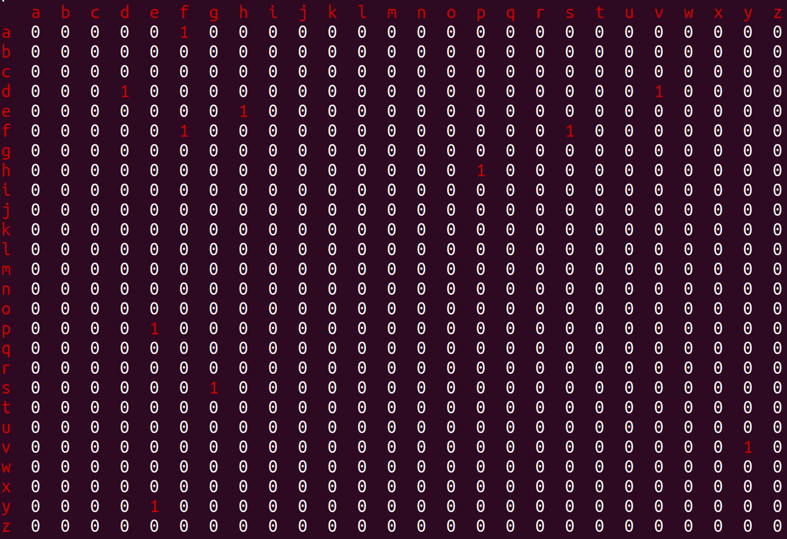

# Document

[TOC]

## 实现原理
### 单词过滤：
过滤异常，非字母单词，对于由特殊符号相连的单词进行分词，并调整字母为小写。
```C++
void wordList::loadingWords(){
    std::unordered_map<std::string, int> Smap;
    std::ifstream inFile(inFileName+FileName);
    while(!inFile.eof())
    {
        std::string S;
        inFile>>S;
        auto Svector = filter(S);
        for(auto it = Svector.begin(); it != Svector.end(); it++){
            auto s = *it;
            if(Smap.count(s) == 0){
                Smap[s] = 1;
                COUT(s);
                wordMatrix.incCount(s);
                wordMatrix.pushWord(s);
            }          
        }
    }
    outputMatrix();
    inFile.close();
}
```
### 单词同一化：
将所有单词进行分类，所有首尾相同的单词为同一类，并将其嵌入到一个wordMatrix中。


### 命令行解析：
通过对命令行参数的判断，将得到不同的程序实现条件，这些Flag将会在之后的程序分支中使用。  
```C++
void cmdParametersParser(int argc, char **argv){
    int ch;

    while((ch=getopt(argc,argv,"w:c:h:t:n:"))!=-1)
    {
        switch(ch)
        {
            case 'w':wordList::FileName = optarg;
                    wordList::WordLens = true;
                    wordList::wc_paranum ++;
                    cout << wordList::FileName <<endl;
                    break;
            case 'c':wordList::FileName = optarg;
                    wordList::WordLens = false;
                    wordList::wc_paranum ++;
                    cout << wordList::FileName <<endl;
                    break;
            case 'h':wordList::head = *optarg;
                    wordList::spechead = true;
                    cout << wordList::head <<endl;break;
            case 't':wordList::tail = *optarg;
                    wordList::spectail = true;
                    cout << wordList::tail <<endl;break;
            case 'n':wordList::specWordLens = true;
                    wordList::specLength = StringtoNum(optarg);
                    cout << wordList::specLength <<endl;
                    break;
            default:;
        }

    }

}
```
其中，-w和-n无法同时使用，-w和-c无法同时使用。
```C++
```
### 深度优先搜索：
使用经典深度优先搜索，但是由于问题是np-hard问题，因此将会将DFS分为个阶段：

* 第一阶段： 将进行彻底的搜索，得到最优解
* 第二阶段： 若问题规模变大，则会采取变深度优先搜索

```C++
```

### 剪枝策略：
若以一个单词a为最开头的链的最大值为c。则以另一个单词b开头，并且搜索到单词a时，已有深度为deep，则这个分支的最大深度必然小于c + deep。这个的正确性由在词集合W中，以单词a开头的链的长度必然大于在词集合W-{一些词}中以单词a开头的链的长度。  
因此当c + deep < 当前最大链长时，此分支必然达不到更好的值。  
但是，c是不可能总算得到的，比如由于剪枝，所以无法判断出确切的最大值。因此为了保证“最大深度必然小于c + deep”特性，我们取c* = max{c + deep}， 因此c* 必然大于以此单词开头的最大深度，即c* > c。  
在程序中，我们设定c* 为estimatedMax。每个矩阵cell，即每类单词只有一个这个属性，都是以这个单词为单词链的开头得到的估计值（第一个搜索的单词的估计值必然是真实值）。


## 测试用例
1. -w -f
2. -c -f
3. -n -f (big scale)
4. -h -t -f (big scale)
5. -w -h -t -f
6. -c -h -t -f
7. -n -h -t -f
8. -n -c -f
9. -n -w -f(exception)
10. -w -c -f(exception)

